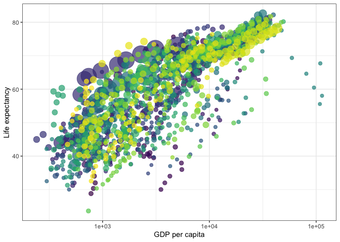
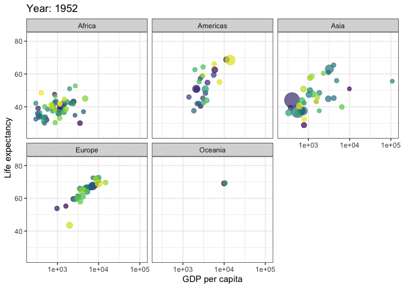

PS07-Gapminder
================

## Gapminder

This is an R Markdown format used for publishing markdown documents to
GitHub. When you click the **Knit** button all R code chunks are run and
a markdown file (.md) suitable for publishing to GitHub is generated.

This article describes how to create animation in R using the gganimate
R package.

According to the article,*gganimate: How to Create Plots with Beautiful
Animation in R*, “Gganimate is an extension of the ggplot2 package for
creating animated ggplots. It provides a range of new functionality that
can be added to the plot object in order to customize how it should
change with time.”

“Key features of gganimate:

1.transitions: you want your data to change 2.views: you want your
viewpoint to change 3. shadows: you want the animation to have memory” -
from article

## Including Code

You can include R code in the document as follows:

``` r
library(ggplot2)
library(gganimate)
theme_set(theme_bw())
library(gapminder)
head(gapminder)
```

    ## # A tibble: 6 × 6
    ##   country     continent  year lifeExp      pop gdpPercap
    ##   <fct>       <fct>     <int>   <dbl>    <int>     <dbl>
    ## 1 Afghanistan Asia       1952    28.8  8425333      779.
    ## 2 Afghanistan Asia       1957    30.3  9240934      821.
    ## 3 Afghanistan Asia       1962    32.0 10267083      853.
    ## 4 Afghanistan Asia       1967    34.0 11537966      836.
    ## 5 Afghanistan Asia       1972    36.1 13079460      740.
    ## 6 Afghanistan Asia       1977    38.4 14880372      786.

Code is taken from here: [1] ## Including Plots

You can also embed plots, for example: Note: the following code is also
taken from the article
<!-- --><!-- -->

Note that the `echo = FALSE` parameter was added to the code chunk to
prevent printing of the R code that generated the plot.

[1] Alboukadel, Transition_reveal, Draga, Tiago, W, C., Danhrogers,
Thaung, K., Sylvan, Kassambara, Kebede, M., Ankit, G, P., Saldaña, S.,
Mark, Lockwood, R. N., Petchulia, Z., Samuel, D. D. K., Artjuch, D.,
Mehmet, & Anthony. (2019, December 25). Gganimate: How to create plots
with beautiful animation in R. Datanovia. Retrieved December 3, 2021,
from
<https://www.datanovia.com/en/blog/gganimate-how-to-create-plots-with->
beautiful-animation-in-r/.
